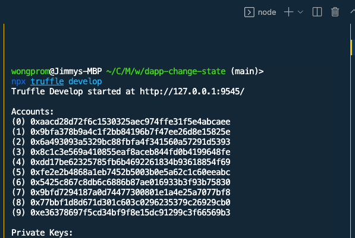
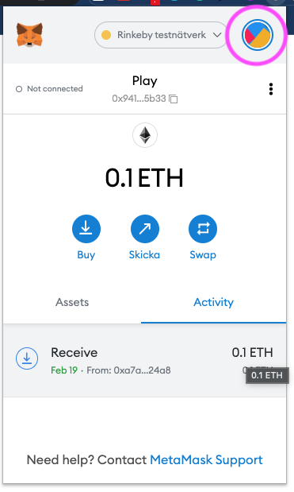
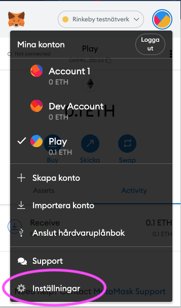
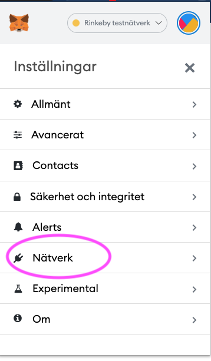
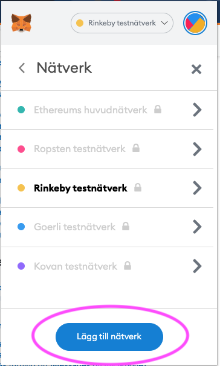
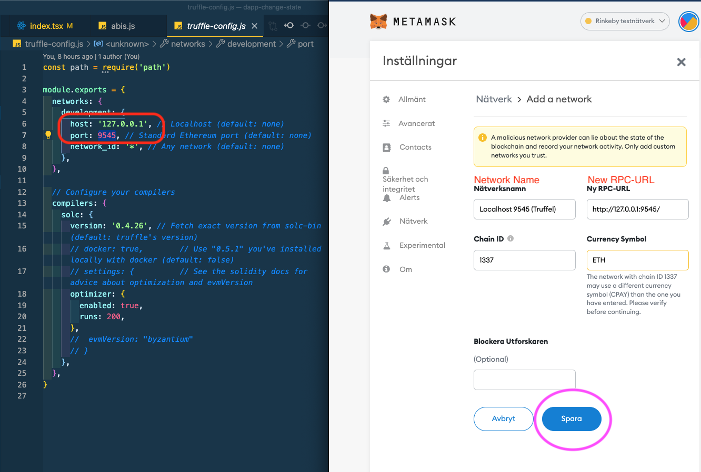
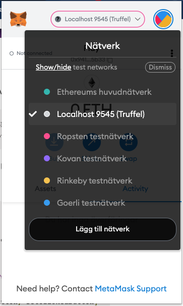
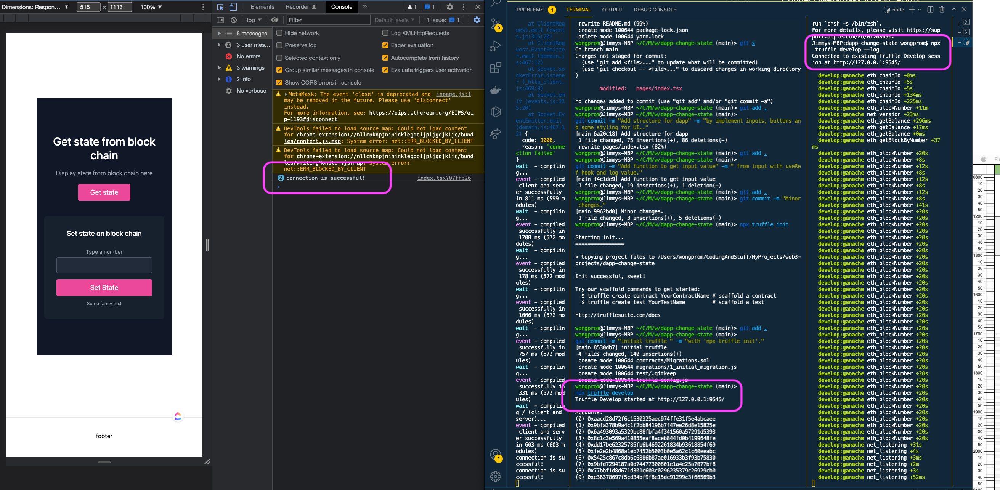

# DApp hange state

A decentralized app where we create Smart Contracts.
...more info

## Getting Started

These instructions will get you a copy of the project up and running on your local machine for development and testing purposes. See deployment for notes on how to deploy the project on a live system.

### Prerequisites

What things you need to install the software and how to install them

```
Give examples
```

### Installing

A step by step series of examples that tell you how to get a development env running

Local packages in project that needs to be installed are

```
npm install @web3-react/core react-loader-spinner web3
```

Global packages that needs to be installed are

```
npm install -g truffle
```

```
npm install ganache --global
```

## Handy links

- [https://trufflesuite.com/](https://trufflesuite.com/) - Sweet Tools for Smart Contracts.
  The Truffle Suite gets developers from idea to dapp as comfortably as possible.

- [https://github.com/trufflesuite/ganache](https://github.com/trufflesuite/ganache) - A tool for creating a local blockchain for fast Ethereum development.

## Handy commands

```
npx truffle init
```

```
npx truffle develop
```

```
truffle migrate --reset --compile-all
```

After running in `npx truffle develop` in terminal, displays 10 accounts with "Private Keys"


```
npx truffle develop --log
```

## Connect Metamask to port: 9545

1. Click "My Accounts", top right corner with round icon



2. Click "Settings"



3. Click "Network"



4. Click "Add Network"



5. Fill form



6. Select the created network



7. Metamask connected successfully



## File changes

truffle-config.js

```
const path = require('path')

module.exports = {
  networks: {
    development: {
      host: '127.0.0.1',
      port: 9545,
      network_id: '*',
    },
  },
  compilers: {
    solc: {
      version: '0.4.26',
      optimizer: {
        enabled: true,
        runs: 200,
      },
    },
  },
}
```

## Running the tests

Explain how to run the automated tests for this system

### Break down into end to end tests

Explain what these tests test and why

```
Give an example
```

### And coding style tests

Explain what these tests test and why

```
Give an example
```

## Deployment

Add additional notes about how to deploy this on a live system

## Built With

- [Dropwizard](http://www.dropwizard.io/1.0.2/docs/) - The web framework used
- [Maven](https://maven.apache.org/) - Dependency Management
- [ROME](https://rometools.github.io/rome/) - Used to generate RSS Feeds

## Contributing

Please read [CONTRIBUTING.md](https://gist.github.com/PurpleBooth/b24679402957c63ec426) for details on our code of conduct, and the process for submitting pull requests to us.

## Versioning

We use [SemVer](http://semver.org/) for versioning. For the versions available, see the [tags on this repository](https://github.com/your/project/tags).

## Authors

- **Billie Thompson** - _Initial work_ - [PurpleBooth](https://github.com/PurpleBooth)

See also the list of [contributors](https://github.com/your/project/contributors) who participated in this project.

## License

This project is licensed under the MIT License - see the [LICENSE.md](LICENSE.md) file for details

## Acknowledgments

- Hat tip to anyone whose code was used
- Inspiration
- etc
